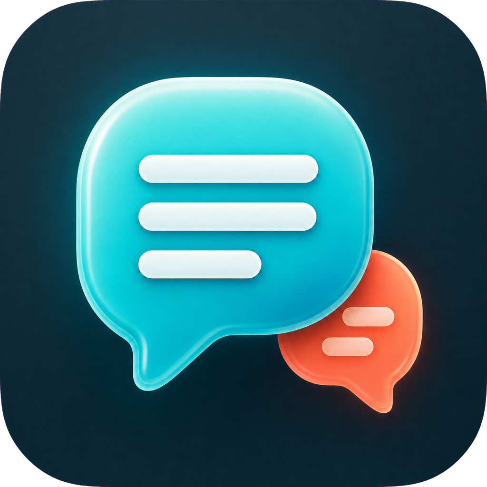

<p align="center">
  
</p>

<h1 align="center">Glossa</h1>

<p align="center">
  A native macOS menu-bar app for live translated subtitles from the audio playing on your Mac.
</p>

<p align="center">
  <a href="site/">Website</a>
  ·
  <a href="CHANGELOG.md">Changelog</a>
  ·
  <a href="ROADMAP.md">Roadmap</a>
</p>

## Overview

Glossa listens to system audio or a microphone fallback, transcribes speech locally, auto-detects the source language, and translates captions into the target language you choose. It is designed as a polished macOS utility: quiet in the menu bar, quick from a compact applet, and readable through a floating subtitle overlay.

The current build is free to develop and local-first. Speech recognition runs through WhisperKit on this Mac. Translation uses Apple Translation first, with an optional LibreTranslate-compatible fallback for Bangla or other unsupported Apple pairs. Glossa contains no OpenAI API integration, no account requirement, and no paid cloud dependency.

## Highlights

- Native SwiftUI macOS app with a dark bird-and-ribbon identity
- Visible menu-bar bird icon with a compact control applet
- Start, pause, target language, capture source, overlay, and latest caption from the applet
- System-audio capture through ScreenCaptureKit
- Microphone fallback through AVAudioEngine
- Automatic source-language detection with local WhisperKit
- Apple on-device translation plus Glossa's promised targets, including Bangla
- Optional LibreTranslate-compatible fallback endpoint
- Floating bilingual subtitle overlay across Spaces and full-screen apps
- Local transcript history and recovery UI for permissions and model setup
- Audio frames are processed in memory and never saved by Glossa

## Requirements

- macOS 15 or newer
- Apple Silicon recommended
- Screen & System Audio Recording permission for system audio capture
- Internet once to download the free Whisper model and any Apple language packs

## Run From Source

```bash
./script/prepare_local_model.sh
./script/build_and_run.sh
```

The app bundle is staged at `dist/Glossa.app`. The default `tiny` multilingual model keeps first-run setup and realtime latency manageable.

## Package A Release

```bash
./script/package_release.sh
```

This creates `dist/Glossa-0.1.0-macOS.zip` and `dist/SHA256SUMS.txt` using an optimized release build.

The zero-budget build uses a stable ad-hoc signature. After downloading it from GitHub, open Glossa once with **Control-click > Open**. A paid Developer ID can be supplied later through `CODESIGN_IDENTITY` for hardened-runtime signing and notarization.

## Privacy

Audio frames are processed in memory and never saved by Glossa. WhisperKit transcribes on this Mac; Apple Translation uses local language packs. Glossa contains no OpenAI API integration or paid cloud dependency.

If you configure a LibreTranslate fallback URL, translated text for unsupported pairs is sent to that endpoint. Use a local endpoint such as `http://127.0.0.1:5000` to keep that fallback on your own machine.

## Project Structure

- `Sources/Glossa`: native macOS app source
- `Assets`: app icon and menu-bar template mark
- `site`: self-contained Next.js landing site for Vercel
- `landing`: static promotional landing page reference
- `script`: build, run, model prep, and release packaging scripts
- `Tests`: SwiftPM test suite

## Status

Glossa is an early local-first build intended for private testing and GitHub distribution. See [CHANGELOG.md](CHANGELOG.md) for shipped milestones and [ROADMAP.md](ROADMAP.md) for planned work.
