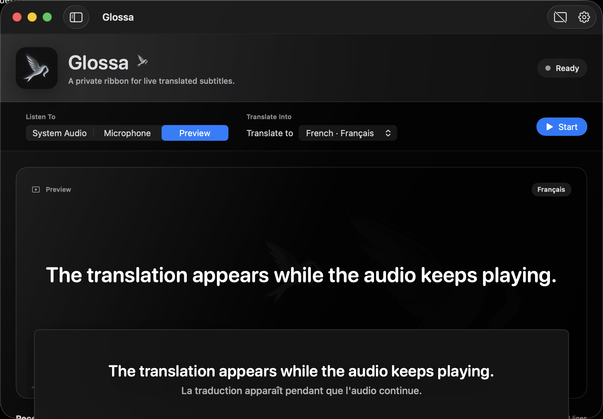

<p align="center">
  
</p>

<h1 align="center">Glossa</h1>

<p align="center">
  Live translated subtitles for whatever your Mac is playing.
</p>

<p align="center">
  <a href="https://github.com/rajin-khan/Glossa/releases/download/v0.1.0/Glossa-0.1.0-macOS.zip">
    
  </a>
</p>

<p align="center">
  
  
  
</p>

<p align="center">
  <a href="#how-it-works">How it works</a>
  ·
  <a href="#install">Install</a>
  ·
  <a href="#privacy">Privacy</a>
  ·
  <a href="ROADMAP.md">Roadmap</a>
</p>

<p align="center">
  
</p>

## Anything, translated live

Glossa is a native macOS menu-bar app that turns system audio into translated subtitles. Pick a target language once, keep listening, and let Glossa detect the spoken language while playback continues.

The core pipeline is free to run and local-first. WhisperKit handles speech recognition on your Mac, Apple Translation handles supported language pairs, and an optional LibreTranslate-compatible endpoint can extend coverage without a required paid API.

## How it works

| | |
| --- | --- |
| **Listen** | Capture audio playing on your Mac with ScreenCaptureKit, or switch to the microphone fallback. |
| **Understand** | Transcribe speech locally with WhisperKit and automatically detect the source language. |
| **Translate** | Use Apple on-device translation first, with an optional LibreTranslate-compatible fallback. |
| **Read** | Follow captions in the main window, compact menu-bar applet, or floating bilingual overlay. |

### Built for the background

- Native SwiftUI interface with a compact menu-bar controller
- Automatic source-language detection
- Target-language switching without restarting capture
- Floating subtitles across Spaces and full-screen apps
- Recent caption history with final and in-progress states
- Permission, model, and fallback recovery built into the app
- Audio frames processed in memory and never saved by Glossa

## Install

> Glossa currently ships as an early preview for macOS 15 Sequoia or later. Apple Silicon is recommended.

1. [Download Glossa 0.1.0 for macOS](https://github.com/rajin-khan/Glossa/releases/download/v0.1.0/Glossa-0.1.0-macOS.zip).
2. Unzip `Glossa-0.1.0-macOS.zip` and move `Glossa.app` to Applications.
3. On first launch, Control-click Glossa and choose **Open**.
4. Choose a target language and grant Screen & System Audio Recording access when prompted.

The preview uses a stable ad-hoc signature so development and testing remain free. It is not notarized with a paid Apple Developer ID yet. You can verify the archive against [`SHA256SUMS.txt`](https://github.com/rajin-khan/Glossa/releases/download/v0.1.0/SHA256SUMS.txt).

### Permissions

| Permission | Why Glossa asks |
| --- | --- |
| Screen & System Audio Recording | Required to hear audio playing on your Mac through ScreenCaptureKit. |
| Microphone | Used only when you explicitly choose Microphone as the capture source. |

Glossa needs an internet connection once to fetch the free Whisper model and any Apple language packs that are not already installed.

## Privacy

Glossa does not require an account, an OpenAI API key, or a paid cloud service.

- Audio is processed in memory and is not saved by Glossa.
- WhisperKit transcription runs locally on your Mac.
- Apple Translation uses local language packs when available.
- No analytics or tracking service is included.
- Text is sent off-device only when you configure a LibreTranslate fallback URL for unsupported language pairs.

For a completely local fallback, point Glossa at a self-hosted endpoint such as `http://127.0.0.1:5000`.

## Build from source

You will need macOS 15 or later, Xcode command-line tools, and an Apple Silicon Mac for the best realtime performance.

```bash
git clone https://github.com/rajin-khan/Glossa.git
cd Glossa
./script/prepare_local_model.sh
./script/build_and_run.sh
```

The app bundle is staged at `dist/Glossa.app`. The default multilingual `tiny` model keeps first-run setup and realtime latency manageable.

### Test

```bash
swift test
```

### Package a release

```bash
./script/package_release.sh
```

This creates `dist/Glossa-0.1.0-macOS.zip` and `dist/SHA256SUMS.txt` from an optimized build. Set `CODESIGN_IDENTITY` later to package with a paid Developer ID, hardened runtime, and notarization.

## Project map

```text
Sources/Glossa   Native macOS application
Tests            SwiftPM test suite
Assets           App icon and menu-bar artwork
script           Model, build, run, and packaging tools
site             Next.js landing page for Vercel
landing          Static landing-page reference
```

## Project status

Glossa is an early local-first preview intended for testing and GitHub distribution. Interfaces, model setup, and translation coverage are still evolving.

See the [changelog](CHANGELOG.md) for shipped work and the [roadmap](ROADMAP.md) for what comes next. Bug reports and thoughtful feature requests are welcome in [GitHub Issues](https://github.com/rajin-khan/Glossa/issues).

<p align="center">
  Built for macOS with SwiftUI, ScreenCaptureKit, Apple Translation, and WhisperKit.
</p>
